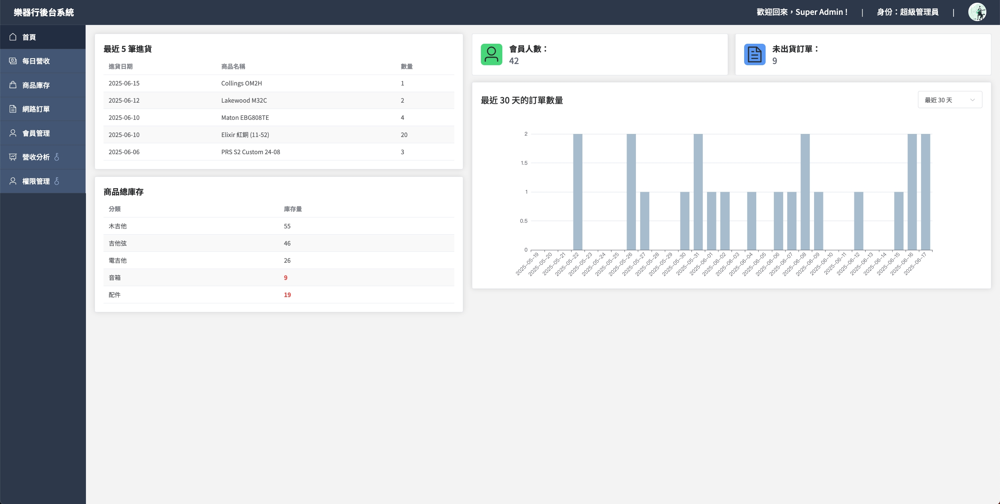
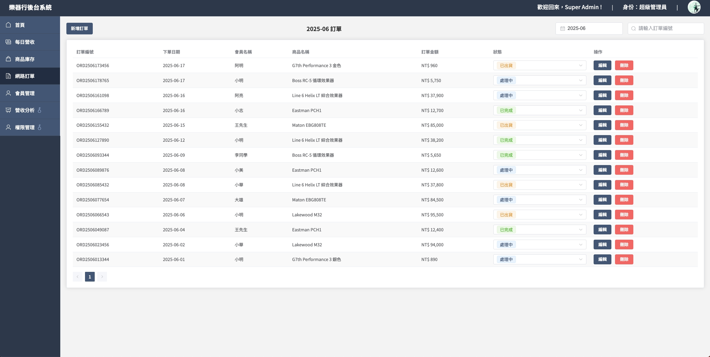
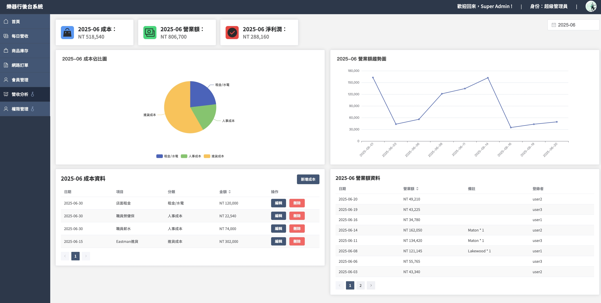
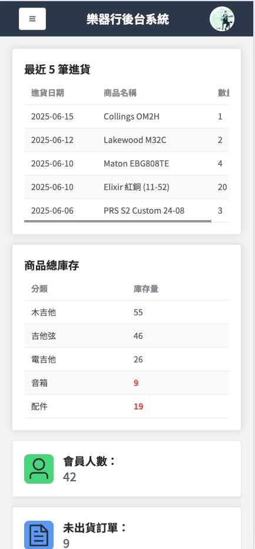
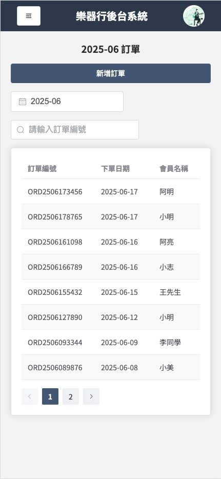
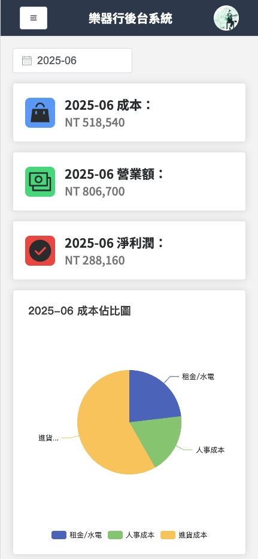

# Music Store Admin 後台管理系統

- 本專案為一套樂器行的後台管理系統，涵蓋會員、商品、訂單管理與營收統計等功能。
- 前端採用 Vue 3 搭配 Vue Router 打造 SPA 架構，並結合 Element Plus 及 Tailwind CSS 強化 UI 設計與 RWD 響應式排版。
- 後端則使用 Node.js（Express）建構 RESTful API，資料持久化則透過 Mongoose 操作 MongoDB。

## demo 連結：https://brianhsu0606.github.io/music-store-admin/
為保護資料內容，目前未提供公開帳密。若需測試帳號，請於面試時提出或聯絡本人索取。

## 使用技術

### 前端
- Vue 3 + Composition API
- Vue Router
- Pinia（狀態管理）
- Element Plus（UI 元件庫）
- Tailwind CSS（RWD 響應式設計）
- Axios（API 串接）

### 後端
- Node.js（Express）
- RESTful API 設計
- Mongoose + MongoDB（資料儲存）
- JWT 驗證機制

## 系統功能介紹
- 首頁：快速瀏覽庫存狀況、近期訂單與進貨資訊
- 每日營收：管理每日的營收狀況
- 商品庫存：管理商品資訊與庫存數量
- 網路訂單：查看並更新顧客訂單
- 會員管理：建立、編輯、刪除會員資料
- 營收分析（僅限管理員）：查看每月成本與營業額報表
- 權限管理（僅限管理員）：調整職員權限
  
## 系統畫面預覽（桌機版）

### 首頁：快速瀏覽最新進貨狀況、庫存數量、基本資訊及近30天的訂單數量

### 每日營收、商品庫存、網路訂單、會員管理：有基本的資料表格及 CRUD 操作功能

### 營收分析（限管理員）：顯示成本與營收的統計圖表，提供數據分析功能 

## RWD 響應式設計（手機版）

  
  
  

